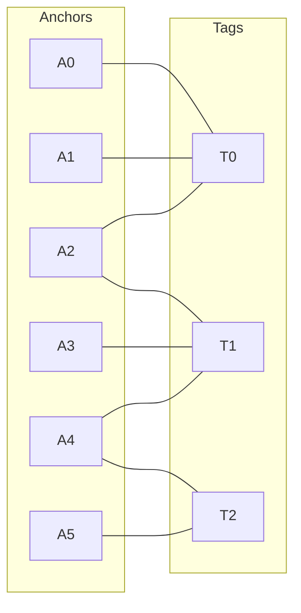
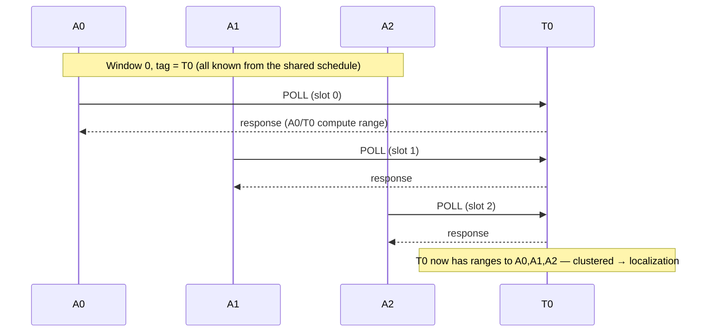

# System overview

> The big picture: entities, roles, the anchor↔tag relationship graphs, and how ranging is scheduled.
> Terms: [GLOSSARY](GLOSSARY.md). Index: [README](README.md).

Top-level explanation of the whole system. Depth is in
[ARCHITECTURE_window_tdma.md](ARCHITECTURE_window_tdma.md) (authoritative); the evolution is in
[DESIGN_FLOW_mesh_tdma.md](DESIGN_FLOW_mesh_tdma.md); variants in [VARIANTS.md](VARIANTS.md).
Diagrams are given as Mermaid (renders on GitHub) **and** ASCII (visible anywhere).

---

## 1. Purpose

Measure distances between many **anchors** (fixed-ish infrastructure) and many **tags** (mobile), so a tag can be **localized** (trilaterated). The hard requirement: for each tag, its ranges from the several anchors must be **clustered in time** (a contemporaneous set) to form one position fix. Far or weak tags are measured **less often** (not dropped). Tags and anchors may move (occasionally) and power may toggle.

## 2. Entities and roles

| Entity | Mobility | Role (window-TDMA) | Notes |
|---|---|---|---|
| **Anchor** | fixed-ish, relocatable | **initiator** — polls tags; runs the ESP-NOW control mesh | judges far/weak from RXP |
| **Tag** | mobile | **responder** — replies to polls, **collects its own ranges** | may not hear other tags |

Two radios / two planes:

```
  control plane      :  Anchor  <-- ESP-NOW mesh -->  Anchor   (anchor-to-anchor coordination)
  measurement plane  :  Anchor  --- UWB poll (TWR) -->  Tag     (Tag responds, collects ranges)
```

UWB (measurement) and WiFi/ESP-NOW (coordination) are **separate radios** → no mutual interference. Tags are not on the mesh; the anchors mediate everything (tags can't always hear each other).

## 3. Anchor–Tag relationship graph (who can range whom)

The fundamental structure is a **bipartite graph**: an edge `A—T` means anchor `A` has an *effective* link to tag `T` (RXP/range good enough to range it, `q ≥ θ_link`). Example deployment:



ASCII (effective links):

```
  tag  ranged by (effective anchors)
  ---  ------------------------------
  T0   A0, A1, A2
  T1   A2, A3, A4
  T2   A4, A5

  anchor  ranges tags
  ------  -----------
  A0      T0
  A1      T0
  A2      T0, T1      <- shared (border) anchor
  A3      T1
  A4      T1, T2      <- shared (border) anchor
  A5      T2
```

**Shared / border anchors** are anchors with edges to multiple tags — here **A2** ranges {T0,T1} and **A4** ranges {T1,T2}. A shared anchor cannot serve two tags at the same instant, so it forces those tags into different windows.

A tag's anchor set is its "cluster"; clusters **overlap** at shared anchors/tags. There is **no manual cluster definition** — this graph is discovered at runtime: each anchor publishes which tags it hears (+RXP) over the mesh, and the union is the bipartite graph.

## 4. Tag conflict graph → windows (spatial reuse)

Project the bipartite graph onto tags: **two tags conflict (need different windows) iff they share an *effective* anchor.**


ASCII:

```
  T0 ---- T1 ---- T2     edge = share an effective anchor
        (A2)   (A4)

  T0 & T1 : share A2   -> conflict (different windows)
  T1 & T2 : share A4   -> conflict (different windows)
  T0 & T2 : share none -> no conflict -> may reuse one window
```

Color = window. Color the tags so conflicting tags differ; **non-conflicting tags reuse a window** (measured concurrently by disjoint anchor sets — spatial reuse):

```
  window 0 :  T0  {A0,A1,A2}   +   T2  {A4,A5}     (disjoint anchors -> concurrent)
  window 1 :  T1  {A2,A3,A4}
```

So only **2 windows** are needed even though there are 3 tags. `A2` ranges T0 in window 0 and T1 in window 1 (never double-booked); `A4` ranges T2 in window 0 and T1 in window 1.

## 5. Two-level TDMA timing

```
  Superframe = [ Window 0 ][ Window 1 ]  (repeats)

  Window 0 :  A0->T0  A1->T0  A2->T0   |   A4->T2  A5->T2
              region 1 (tag T0)            region 2 (tag T2)   -> concurrent (disjoint anchors)
  Window 1 :  A2->T1  A3->T1  A4->T1

  within a window, the anchors poll in a fair slot order (no priority)
```

**Window level** (which tag): tag→window coloring, weighted so **far/weak tags get fewer windows**.

**Slot level** (within a window): the participating anchors poll the window's tag in a **fair** order (distributed coloring) so their polls don't collide.

Both are computed by the **anchor mesh**, and time is **gossip-synced locally** (only within a conflict neighborhood; far reuse regions need not align).

## 6. Measurement flow (one window)



A tag's ranges from all its (effective) anchors land inside its one window → **temporally clustered**.

## 7. far/weak handling (three places)

| Where | What | Metric |
|---|---|---|
| **Anchor selection** (in a window) | only anchors with a good link range the tag | `q(a,T) ≥ θ_link` |
| **Window priority** (between conflicting tags) | far/weak tag gets fewer windows | `W̄_S = mean` of `q` over **shared effective anchors** (count-normalized, not a sum) |
| **Candidate** (tag with no eligible anchor) | not dropped; probed at min rate `K_probe`, re-enters if a link improves | — |

`q(a,T)` (link quality) is a **pluggable** function (first-cut `= RXP`), isolated so it can later use range / NLOS / geometry without touching the scheduler.

## 8. Coordination (all on the anchor mesh)

Anchors share a **tag registry** (`(tagId, rxp, range)` per anchor) over ESP-NOW, so the bipartite graph, weights, and the deterministic window schedule are computed **identically** by every anchor.

**Hidden tags** (tags that can't hear each other but share an anchor) are serialized automatically: one tag per window means only that tag transmits, so there is no collision even when they are mutually unheard.

**Emergent clusters**: coordination is local (a tag only needs a window distinct from tags it conflicts with), shared anchors bridge regions, and the windows needed equal the local tag density, not the global tag count.

Mobility / power churn → registry refresh → graph + coloring re-converge locally.

## 9. Variant families (firmware)

| Family | Tag role | Anchor role | Use |
|---|---|---|---|
| **Standard** (`tag/anchor_dw1000_accuracy`) | initiator (broadcast POLL) | responder | native mf-DW1000 ranging, ≤4 anchors/tag, no mesh |
| **mesh-TDMA** (`*_meshagent` / `*_responder`) | responder | initiator (scheduled poll) | the window-TDMA system above |

See [`VARIANTS.md`](./VARIANTS.md). Roles are **inverted** between the two families.

## 10. Status

**Standard** variants build and do basic broadcast ranging.

**mesh-TDMA**: anchor-initiated single-poll (F-a) + ESP-NOW mesh coordination + epoch sync (F-b) is validated on hardware (2 anchors). The **window** layer (§3–§6) is designed (this doc + `ARCHITECTURE_window_tdma.md`) and pending implementation (roadmap W-1…W-4 there).
